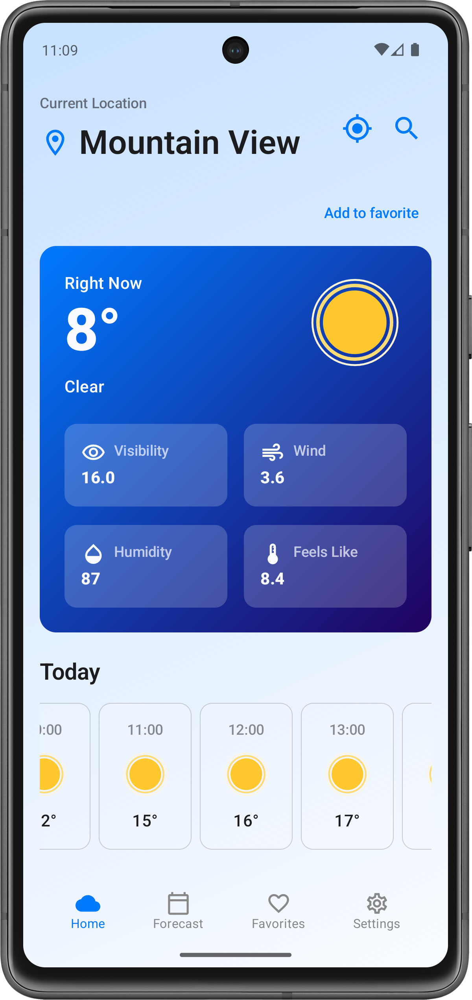
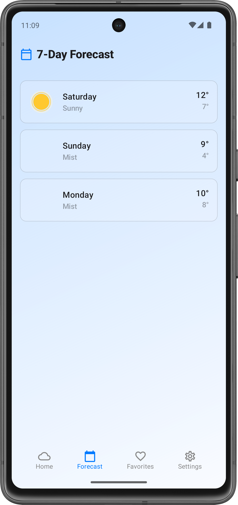
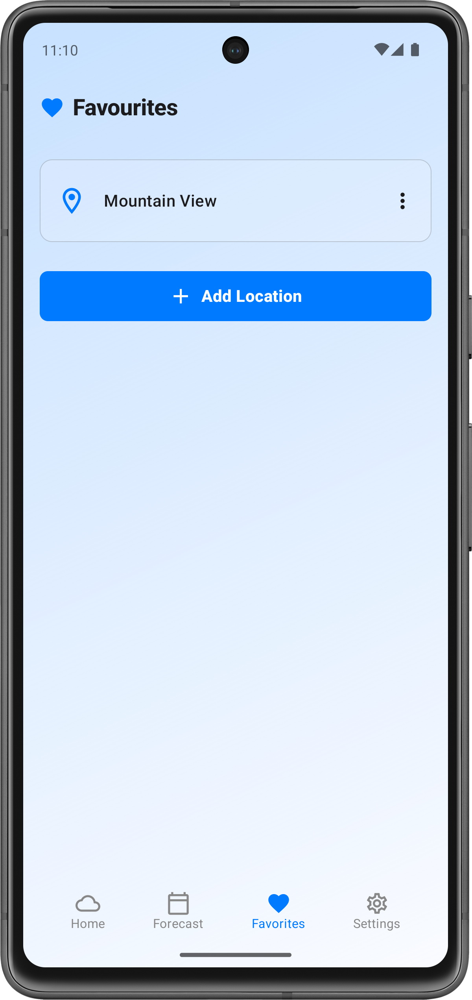
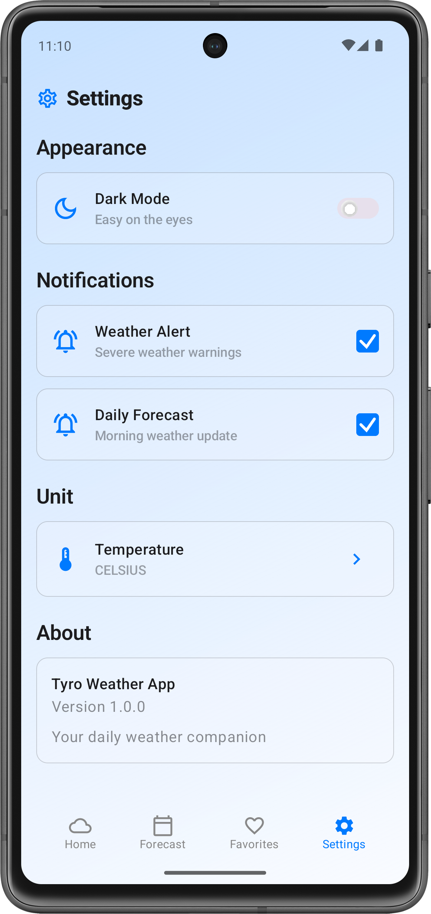

# weather_mobile_application
A weather mobile application that provides real-time weather updates, forecasts, and location-based insights.

# WeatherApp
---

## Features
- View current temperature, humidity, and conditions
- 3-day forecast with hourly breakdown
- Search cities by name
- Auto-detect user location
- Clean, modern UI with Compose

---

## Tech Stack
- **Language:** Kotlin 
- **UI:** Jetpack Compose  
- **Architecture:** MVVM  
- **API:** weatherapi
- **Dependency Injection:** Hilt

---

## Screenshots





---

## Setup
1. Clone the repository  
   ```bash
   git clone https://github.com/crystalz05/weather_mobile_application.git
